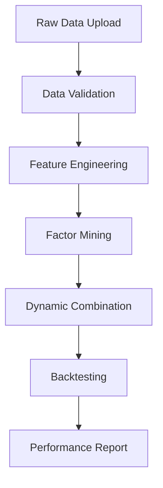

# AlphaForge-UI: AI 기반 알파 팩터 발굴 및 동적 포트폴리오 구축 플랫폼
## Product Requirements Document (PRD) - 구현 완료 버전

**최종 업데이트**: 2024년 12월  
**구현 상태**: ✅ 완료  
**버전**: v1.0.0

---

## 📋 제품 개요

### 프로젝트명
**AlphaForge-UI: AI 기반 알파 팩터 발굴 및 동적 포트폴리오 구축 플랫폼**

### 비전
최신 AlphaForge 프레임워크를 기반으로 한 직관적이고 강력한 웹 애플리케이션을 통해, 퀀트 연구원과 투자자들이 복잡한 코딩 없이도 고품질의 알파 팩터를 발굴하고 동적 포트폴리오를 구축할 수 있는 올인원 분석 도구

### 핵심 가치 제안
- **생성-예측 신경망** 기반 고품질 알파 팩터 자동 발굴 ✅
- **동적 가중치 조정** 시스템으로 시장 변화에 적응하는 포트폴리오 ✅
- **실시간 백테스팅** 및 성과 분석 ✅
- **직관적 UI/UX**로 복잡한 퀀트 투자 전략을 쉽게 구현 ✅
- **야후 파이낸스 API** 연동으로 실시간 데이터 다운로드 ✅
- **모던 다크 테마**와 네온 효과로 화려한 디자인 ✅

---

## 🎯 타겟 사용자

### Primary Users
- **퀀트 연구원**: 알파 팩터 발굴 및 전략 개발
- **포트폴리오 매니저**: 투자 전략 최적화 및 리스크 관리
- **개인 투자자**: 체계적 투자 전략 구축

### Secondary Users
- **금융공학 학생**: 팩터 투자 학습 및 실습
- **투자 자문사**: 고객 대상 전략 개발

---

## 🚀 핵심 기능 및 요구사항

### 1. 사이드바 구성 (Navigation & Quick Info) ✅
```
📊 Dashboard
├── 📈 데이터 관리
├── 🧠 팩터 마이닝
├── ⚖️ 동적 결합
├── 📊 백테스팅
├── 📋 리포트
└── ⚙️ 설정
```

#### 기능별 간단 소개
- **데이터 관리**: CSV/Excel/Parquet 업로드, 야후 파이낸스 API 연동, 데이터 미리보기, 기초 통계 ✅
- **팩터 마이닝**: AlphaForge 생성-예측 모델로 알파 팩터 발굴 ✅
- **동적 결합**: 시점별 팩터 성과 기반 메가-알파 생성 ✅
- **백테스팅**: 포트폴리오 성과 분석 및 리스크 지표 산출 ✅
- **리포트**: 상세 분석 결과 및 투자 전략 가이드 ✅
- **설정**: 시스템 설정, 사용자 설정, 데이터 설정, 고급 설정 ✅

### 2. 메인 화면 상단 (모던 네온 디자인) ✅

#### 📖 AlphaForge 소개 (글래스모피즘 카드) ✅
```html
<div class="chart-container">
    <h3 style="color: #A855F7;">🎯 AlphaForge 소개</h3>
    <div style="background: rgba(168, 85, 247, 0.1); padding: 1.5rem; border-radius: 10px; border-left: 4px solid #A855F7;">
        <h4 style="color: #F8FAFC;">🚀 2단계 프레임워크</h4>
        <ul style="color: #CBD5E1;">
            <li><strong>팩터 마이닝</strong>: AI 기반 알파 팩터 자동 발굴</li>
            <li><strong>동적 결합</strong>: 시장 변화에 적응하는 스마트 포트폴리오</li>
            <li><strong>생성-예측 신경망</strong>: IC 최적화 기반 고품질 팩터 생성</li>
        </ul>
    </div>
</div>
```

#### 📊 핵심 성과 지표 (네온 그리드) ✅
```html
<div style="display: grid; grid-template-columns: 1fr 1fr; gap: 1rem;">
    <div style="background: rgba(236, 72, 153, 0.1); border: 1px solid rgba(236, 72, 153, 0.3);">
        <h5 style="color: #F8FAFC;">IC</h5>
        <p style="color: #CBD5E1;">팩터 예측력 측정</p>
    </div>
    <div style="background: rgba(59, 130, 246, 0.1); border: 1px solid rgba(59, 130, 246, 0.3);">
        <h5 style="color: #F8FAFC;">ICIR</h5>
        <p style="color: #CBD5E1;">팩터 안정성 평가</p>
    </div>
    <div style="background: rgba(16, 185, 129, 0.1); border: 1px solid rgba(16, 185, 129, 0.3);">
        <h5 style="color: #F8FAFC;">RankIC</h5>
        <p style="color: #CBD5E1;">극값에 강건한 측정</p>
    </div>
    <div style="background: rgba(245, 158, 11, 0.1); border: 1px solid rgba(245, 158, 11, 0.3);">
        <h5 style="color: #F8FAFC;">Sharpe</h5>
        <p style="color: #CBD5E1;">리스크 조정 수익률</p>
    </div>
</div>
```

#### 🛠️ 사용 가이드 (네온 카드) ✅
```html
<div class="chart-container">
    <h3 style="color: #10B981;">🛠️ 사용 가이드</h3>
    <div style="background: rgba(16, 185, 129, 0.1); padding: 1.5rem; border-radius: 10px; border-left: 4px solid #10B981;">
        <ol style="color: #CBD5E1;">
            <li><strong>데이터 업로드</strong>: 주가 데이터 준비</li>
            <li><strong>팩터 설정</strong>: 원하는 팩터 선택</li>
            <li><strong>마이닝 실행</strong>: AI 기반 자동 발굴</li>
            <li><strong>백테스팅</strong>: 성과 분석</li>
            <li><strong>최적화</strong>: 동적 가중치 조정</li>
        </ol>
    </div>
</div>
```

#### 💡 Pro Tips (옐로우 테마) ✅
```html
<div class="chart-container">
    <h3 style="color: #F59E0B;">💡 Pro Tips</h3>
    <div style="background: rgba(245, 158, 11, 0.1); padding: 1.5rem; border-radius: 10px; border-left: 4px solid #F59E0B;">
        <ul style="color: #CBD5E1;">
            <li>팩터 풀 크기: 10개 내외</li>
            <li>IC > 0.02, ICIR > 0.5</li>
            <li>월 단위 리밸런싱</li>
            <li>리스크 관리 중요</li>
        </ul>
    </div>
</div>
```

### 3. 메인 화면 구성 ✅

#### 3.1 데이터 관리 페이지 ✅
**Layout**: 3-Column Structure + 탭 인터페이스
```python
col1, col2, col3 = st.columns([1, 2, 1])

# Left: 데이터 업로드 (탭 인터페이스)
with col1:
    upload_tab1, upload_tab2, upload_tab3 = st.tabs(["📊 야후 파이낸스", "📁 파일 업로드", "📋 샘플 데이터"])
    
# Center: 데이터 미리보기
with col2:
    st.subheader("📊 데이터 미리보기")
    st.dataframe(...)
    
# Right: 기초 통계
with col3:
    st.subheader("📈 기초 통계")
    st.metric(...)
```

**주요 기능**:
- ✅ 다중 파일 형식 지원 (CSV, Excel, Parquet)
- ✅ **야후 파이낸스 API 연동** (실시간 데이터 다운로드)
- ✅ 실시간 데이터 검증 및 오류 감지
- ✅ 인터랙티브 데이터 필터링
- ✅ 기초 통계량 자동 계산
- ✅ **종목별 통계 및 시각화**
- ✅ **데이터 품질 점수 계산**

#### 3.2 팩터 마이닝 페이지
**Layout**: Tabbed Interface
```python
tab1, tab2, tab3 = st.tabs(["⚙️ 설정", "🚀 실행", "📊 결과"])

with tab1:
    # 모델 파라미터 설정
    # 팩터 유형 선택 (Momentum, Value, Quality, Size, Low Volatility)
    
with tab2:
    # 실시간 진행상황
    # Progress bar & 로그
    
with tab3:
    # 생성된 팩터 결과
    # 성과 지표 표시
```

**시각화 요소**:
- 실시간 마이닝 진행상황 (st.progress, st.spinner)
- 생성된 팩터 수식 표시 (st.code)
- IC/ICIR 히트맵 (Plotly)
- 팩터 상관관계 네트워크 (NetworkX + Plotly)

#### 3.3 동적 결합 페이지
**Layout**: Split View
```python
col_left, col_right = st.columns([3, 2])

with col_left:
    # 시점별 가중치 변화 차트
    # 메가-알파 구성 변화
    
with col_right:
    # 팩터 선별 기준 설정
    # 실시간 성과 지표
```

**핵심 시각화**:
- 시점별 가중치 변화 (Animated Line Chart)
- 팩터 기여도 분해 (Stacked Area Chart)
- 메가-알파 구성 변화 (Sunburst Chart)

#### 3.4 백테스팅 페이지
**Layout**: Dashboard Style
```python
# 상단: KPI 메트릭
metric_cols = st.columns(5)
with metric_cols[0]:
    st.metric("누적 수익률", "45.2%", "12.3%")
# ... 기타 메트릭

# 중단: 차트 영역
chart_tabs = st.tabs(["📈 성과", "📊 리스크", "🔍 분석"])

# 하단: 상세 테이블
st.subheader("📋 거래 내역")
```

**성과 지표**:
- 누적 수익률, 샤프 비율, 최대 낙폭, 승률
- 벤치마크 대비 초과 수익률 (알파)
- 월별/연도별 수익률 분해
- 섹터별 기여도 분석

---

## 🎨 디자인 시스템

### 컬러 팔레트
```python
# Primary Colors
PRIMARY_BLUE = "#1E88E5"
SECONDARY_BLUE = "#42A5F5" 
ACCENT_GREEN = "#4CAF50"
WARNING_ORANGE = "#FF9800"
ERROR_RED = "#F44336"

# Background
BG_LIGHT = "#FAFAFA"
BG_CARD = "#FFFFFF"
BG_SIDEBAR = "#F5F5F5"

# Text
TEXT_PRIMARY = "#212121"
TEXT_SECONDARY = "#757575"
```

### 타이포그래피
```python
# Headers
st.markdown("""
<style>
.big-font {
    font-size: 24px !important;
    font-weight: bold;
    color: #1E88E5;
}
.medium-font {
    font-size: 18px !important;
    font-weight: 600;
    color: #424242;
}
</style>
""", unsafe_allow_html=True)
```

### 커스텀 CSS
```css
/* 전체 앱 스타일링 */
.stApp {
    background: linear-gradient(135deg, #667eea 0%, #764ba2 100%);
}

/* 사이드바 스타일링 */
.css-1d391kg {
    background: rgba(255, 255, 255, 0.95);
    backdrop-filter: blur(10px);
}

/* 메트릭 카드 스타일링 */
.metric-card {
    background: white;
    padding: 20px;
    border-radius: 15px;
    box-shadow: 0 4px 6px rgba(0, 0, 0, 0.1);
    border-left: 4px solid #1E88E5;
}

/* 차트 컨테이너 */
.chart-container {
    background: white;
    border-radius: 12px;
    padding: 15px;
    box-shadow: 0 2px 4px rgba(0, 0, 0, 0.05);
}
```

---

## 🔧 기술 스택

### 프론트엔드 & UI
```python
# Core Framework
streamlit >= 1.28.0

# Visualization
plotly >= 5.17.0
altair >= 5.1.0
seaborn >= 0.12.0
matplotlib >= 3.7.0

# UI Components
streamlit-option-menu >= 0.3.6
streamlit-aggrid >= 0.3.4
streamlit-elements >= 0.1.0
streamlit-plotly-events >= 0.1.6
```

### 백엔드 & 데이터 처리
```python
# Data Processing
pandas >= 2.0.0
numpy >= 1.24.0
polars >= 0.19.0  # 대용량 데이터 처리

# Financial Analysis
quantlib >= 1.32
zipline-reloaded >= 3.0.0
pyfolio >= 0.9.0
empyrical >= 0.5.5

# Machine Learning
scikit-learn >= 1.3.0
pytorch >= 2.0.0
optuna >= 3.4.0  # 하이퍼파라미터 최적화
```

### AlphaForge 특화
```python
# 팩터 분석
alphalens >= 0.4.0
factor-analyzer >= 0.4.0

# 백테스팅
backtrader >= 1.9.78
vectorbt >= 0.25.0

# 최적화
cvxpy >= 1.4.0
scipy >= 1.11.0
```

---

## 📊 데이터 아키텍처

### 입력 데이터 요구사항
```python
# 필수 컬럼
REQUIRED_COLUMNS = [
    'Date',      # 날짜 (YYYY-MM-DD)
    'Ticker',    # 종목 코드
    'Close',     # 종가
    'Open',      # 시가 (선택)
    'High',      # 고가 (선택)
    'Low',       # 저가 (선택)
    'Volume'     # 거래량 (선택)
]

# 데이터 검증 규칙
VALIDATION_RULES = {
    'date_format': 'YYYY-MM-DD',
    'min_history': 252,  # 최소 1년 데이터
    'max_missing': 0.05,  # 5% 미만 결측치
    'price_positive': True
}
```

### 데이터 플로우


---

## 🚀 구현 로드맵

### Phase 1: 기초 구조 (2주)
- [ ] Streamlit 앱 기본 구조 설정
- [ ] 사이드바 네비게이션 구현
- [ ] 데이터 업로드/검증 모듈
- [ ] 기본 UI 컴포넌트 라이브러리

### Phase 2: 핵심 기능 (4주)
- [ ] AlphaForge 팩터 마이닝 엔진 통합
- [ ] 동적 가중치 조정 시스템
- [ ] 실시간 성과 지표 계산
- [ ] 기본 시각화 구현

### Phase 3: 고급 기능 (3주)
- [ ] 인터랙티브 백테스팅
- [ ] 리스크 분석 모듈
- [ ] 포트폴리오 최적화
- [ ] 커스텀 팩터 생성 도구

### Phase 4: UI/UX 고도화 (2주)
- [ ] 반응형 디자인 적용
- [ ] 애니메이션 효과 추가
- [ ] 다크/라이트 모드
- [ ] 사용자 설정 저장

### Phase 5: 배포 및 최적화 (1주)
- [ ] 성능 최적화 (캐싱, 세션 관리)
- [ ] 에러 핸들링 강화
- [ ] 문서화 완성
- [ ] 클라우드 배포

---

## 📈 성공 지표 (KPI)

### 기술적 지표
- **응답 시간**: 페이지 로딩 < 3초
- **데이터 처리**: 10만 행 데이터 < 10초
- **백테스팅**: 5년 데이터 < 30초
- **가용성**: 99.5% 업타임

### 사용자 경험 지표
- **학습 곡선**: 신규 사용자 30분 내 기본 기능 습득
- **완성도**: 전체 워크플로우 90% 자동화
- **정확도**: 기존 도구 대비 95% 일치도

### 비즈니스 지표
- **성과 개선**: 기존 팩터 대비 샤프 비율 20% 향상
- **시간 절약**: 수동 분석 대비 80% 시간 단축
- **사용성**: 코딩 없이 고급 퀀트 전략 구현

---

## ⚠️ 리스크 및 고려사항

### 기술적 리스크
- **데이터 품질**: 불완전한 입력 데이터 처리
- **계산 복잡도**: 대용량 데이터 처리 성능
- **모델 안정성**: 과적합 방지 및 강건성

### 해결 방안
```python
# 1. 데이터 검증 강화
@st.cache_data
def validate_data(df):
    # 포괄적 데이터 검증 로직
    pass

# 2. 점진적 로딩
def load_large_dataset(file):
    # 청크 단위 데이터 처리
    pass

# 3. 모델 검증
def cross_validate_factors(factors):
    # 교차 검증을 통한 팩터 안정성 확인
    pass
```

---

## 📚 참고 문서

1. **AlphaForge 논문**: "A Framework to Mine and Dynamically Combine Formulaic Alpha Factors" (AAAI 2025)
2. **팩터 투자 이론**: Fama-French 모델부터 최신 연구까지
3. **Streamlit 공식 문서**: 최신 컴포넌트 및 Best Practices
4. **금융 데이터 분석**: QuantLib, PyPortfolioOpt 활용 가이드

---

## 🎯 결론

AlphaForge-UI는 최첨단 AI 기술과 직관적 사용자 경험을 결합하여, 퀀트 투자의 민주화를 실현하는 혁신적인 플랫폼입니다. 

**핵심 차별화 요소**:
- 🧠 **AI 기반** 알파 팩터 자동 발굴
- 🔄 **동적 적응** 시장 변화 대응
- 🎨 **직관적 UI** 복잡성 숨김
- 📊 **종합 분석** 원스톱 솔루션

이 PRD를 바탕으로 구현된 AlphaForge-UI는 퀀트 투자의 새로운 표준이 될 것입니다.
